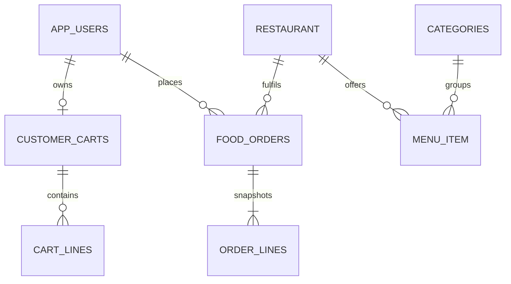

# Database and domain model

H2 file database by default; optional MySQL profile. Hibernate/JPA creates schema from entities. Monetary amounts are DECIMAL(12,2); application arithmetic uses BigDecimal.

| Table | Main fields | Relationship / rule |
| --- | --- | --- |
| app_users | id, name, email, password, role, enabled, google_subject | Unique email, unique nullable Google subject; BCrypt password hidden from JSON |
| restaurant | id, name, cuisine, address, emoji, active | One restaurant has many menu items and orders |
| categories | id, name | Unique name, application case-insensitive uniqueness |
| menu_item | id, restaurant_id, category_id, name, description, price, available, vegetarian | References restaurant/category by IDs checked in services |
| customer_carts | id, customer_id, version | One saved cart per customer |
| cart_lines | cart_id, menu_item_id, quantity | JPA element collection owned by cart |
| food_orders | id, customer_id, restaurant_id, snapshots, status, totals, version, created_at | One customer and restaurant per order; optimistic lock |
| order_lines | order_id, line_position, menu_item_id, name, quantity, unit_price, line_total | Owned snapshot collection, never recalculated from edited menu |

Scalar user/restaurant/category IDs are application-validated rather than JPA ManyToOne mappings. JPA collection join columns are managed by Hibernate. Restaurants/menu items are deactivated, not hard deleted; order snapshots preserve history. Categories can be deleted only when unused. User accounts are disabled, not erased.

These are logical relationships; see Java entity annotations for actual generated names and constraints. Back up `data/` only when the app is stopped, or use database-supported backup mechanisms. The app does not include automated migrations between H2 and MySQL.
